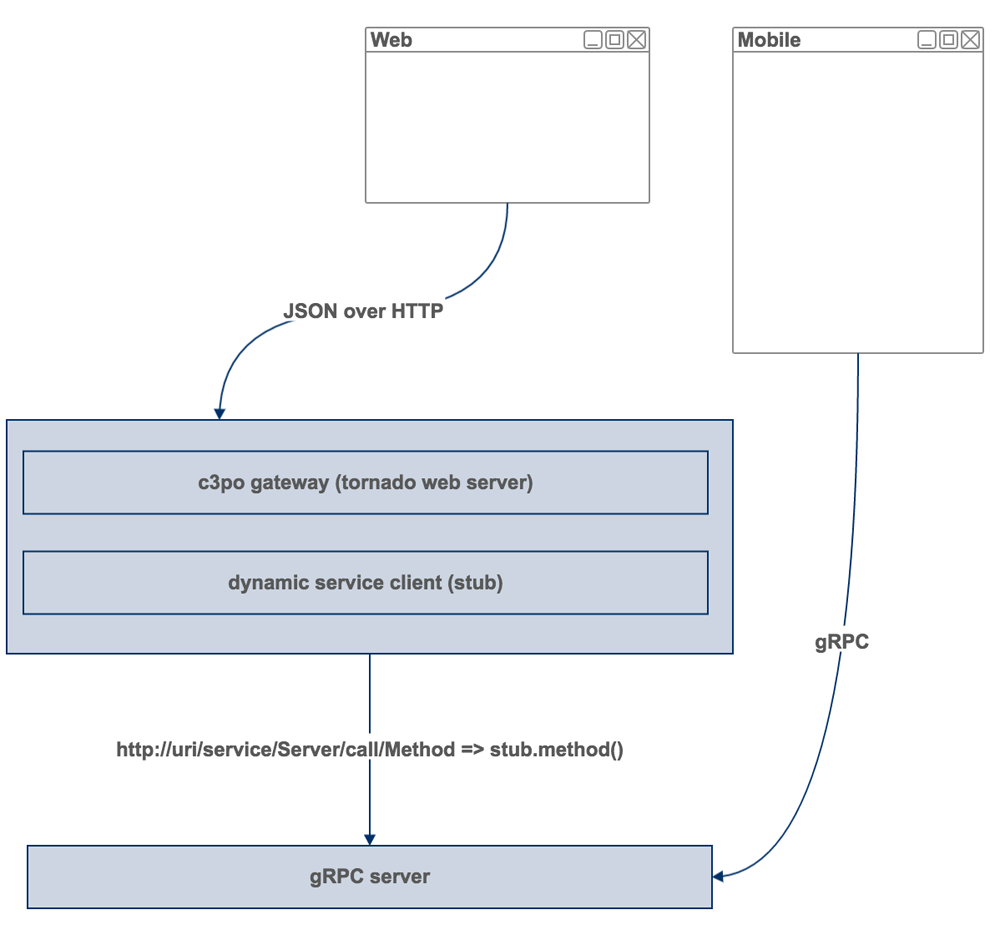

# C3PO

A light weight Python gRPC transport layer gateway with tornado named c3po.

# Overview

This is a light weight Python gRPC gateway. A simple transform layer. Translate gRPC protobuf objects to JSON objects.

Sometimes we are using gRPC and protobuf, but for Web and other language which not support gRPC, we could use this simple transport layer.



# Example

Just look into the examples folder.

## Protobuf

Use method option.

```diff
syntax = "proto3";

+ import "google/protobuf/descriptor.proto";
+
+ extend google.protobuf.MethodOptions {
+     MO mo = 50006;
+ }
+
+ message MO {
+     string method = 1;
+ }

message HelloRequest {
    string say    = 1;
}

message HelloResponse {
    string reply  = 1;
}

service SimpleService {
    rpc Hello(HelloRequest) returns (HelloResponse){
+       option (mo).method = "GET";
    }
}
```

## Python

Right now we could run `gen_code.sh`. We get `server_pb2.py`. But C3PO could not transform gRPC/Protobuf Project to HTTP/JSON. We have to create a gRPC client to connect with server.

The best way is load client codes dynamic.

If we have a gRPC service called A, we need to have A server and A client.

C3PO load A client dynamic and call client function by using A client.

## C3PO server

```python
from c3po.server import Server, Stub

app = Server()

stub = Stub()
stub.name = 'hello'
# load client py from path
stub.client_import_type = 'path'
stub.client_module_path = (CURRENT_DIR + '/grpc/client.py')
stub.client_module_name = 'client'
# this means client.get_client()
stub.get_client_func = 'get_client'

stub.server_pb2_import_type = 'path'
# Python get method option is hard
# right now read option from server_pb2
stub.server_pb2_module_name = 'server_pb2'
stub.server_pb2_module_path = (CURRENT_DIR + '/grpc/server_pb2.py')

# we could regist multi stub
app.register(stub)

try:
    print('running server on 0.0.0.0:8888')
    app.run(debug=True)
except KeyboardInterrupt:
    pass
```

1. `grpc` folder has grpc server and grpc client
2. `examples` folder has c3po server

# Dynamic module loader

We have two way to load the client

1. import client from module
2. import client from path

# TODO

This is in develop.

Contact me at soundbbg@gmail.com
